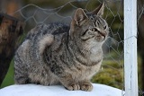

# Anto's Photos

# Introduction

 Welcome to Anto's Photos, A responsive, mobile first website built to promote a fictional photography business.
 It is targeted at people looking to hire a photographer.
 It will be useful to people looking to hire a photographer quickly and easily.

 Live site link: https://01anto.github.io/antos-photos/

 Repository link: https://github.com/01anto/antos-photos

 

# Table of contents
* [Introduction](#introduction)
* [Owner and User Requirements](#owner-and-user-requirements)
* [Design](#design)
* [Features](#features)
* [Testing](#testing)
* [Bugs](#bugs)
* [Deployment](#deployment)
* [Future Features](#future-features)
* [Languages Used](#languages-used)
* [Frameworks and Libraries used](#frameworks-and-libraries-used)
* [Credits](#credits)

# Owner and User Requirements

  ## Owner Stories

  - As an owner I want:

    - To get the company known.
    - To Increase our sales.
    - To show our work.
    - Increase our social media presence.

  ## User Stories

  - As a user I want:

    - To know what the website is about the moment I see the website.
    - An easy to navigate website, no matter what device I use to access it.
    - To quickly navigate to what areas interest me with minimum load times.
    - To see examples of the photographers previous work.
    - A quick and easy way to get in contact.

# Design

  ## Wireframe
   [wireframe](readme-extras/wireframe.pdf)

  ## Color Scheme
   [Color Scheme](readme-extras/coolors-pp1.pdf)

  ## Fonts
  

  ## Images
  
  
  
  

# Features

  ## NAVIGATION LINKS/HEADER
  
   
  
   - The navigation menu is located at the top of the page inside the header.
   - The Anto's Photos logo on the top left refreshes the website when clicked.
   - The other links are located to the top right (HOME, ABOUT, GALLERY and CONTACT US) and when
     clicked bring the user to the relevant page section.
   - The Links to the right change to an orange color and are underlined white when the mouse hovers over them.
   - On smaller screens the Logo will be located and centered at the top of the screen and
     the other links will display in a column below the logo.
     
  ## HOME
  
  
   - The Home section contains the Sales Pitch. It quickly summarises for the user what the website
     is about and what services are provided. For customers in a hurry, a book now button is 
     conveniently
     provided that will bring them straight to the contact us section, bypassing the about and 
     gallery sections.
   - The background in the book now link changes to an orange color when the mouse hovers over it.

  ## ABOUT
  
   - The About section builds on what was said in the home section. It provides the user with an
     insight to the competency and character of the people that they are thinking of hiring. It
     emphasises to the user that these are people that know what they are doing and will do an
     amazing job.

  ## GALLERY
  
  
   - The Gallery section presents three images to the user. These images give the user an idea
     of the photographers style and the type of photographs that they can aspire to have.
   - On smaller screens the images will appear vertically.

  ## CONTACT US
  
   
  
   - The Contact Us section contains a form to allow the user to get in contact with the 
     company.
   - The background in the submit changes to an orange color when the mouse hovers over it.
   - The submitted information is sent to Code Institutes Form Dump.

  ## SOCIAL LINKS/FOOTER
  
  
   - Three social links to Facebook, Youtube and Instagram are provided in the website footer.
     The footer also contains Copyright information.
   - The color of the social links change to orange when the mouse hovers over them.

# Testing

  ## Mobile testing

   - The website was built from the start with mobile first design. It has been tested with
     chrome dev tools on smaller screens and it is responsive.
   - Once the website went live I accessed the website through various phones and ensured
     that it performed as expected.

  ## Desktop testing

 - Large Monitor and TV

   - The website has been tested with chrome dev tools for larger screens and it is
     responsive.
   - Once the website went live I accessed the website using a larger monitor and TV and
     ensured that it performed as expected.

  ## Browser Testing

   - Once the website went live it was run and tested on different browsers and performs
     as expected.

  ## Validator Testing

   - W3C HTML Validator - Passed
   - W3C CSS Jigsaw Validator - Passed
   - Lighthouse Results:
   - 

# Bugs

  ## Fixed Bugs

   - Upon running the w3c html validator it highlighted some errors due to spacing typos and stray closing tags. Once removed and 
     retested again the code passed.
   - Upon running lighthouse it highlighted that my background image was affecting my results. The image was resized and this greatly 
     increased the overall result.
   - Upon running lighthouse it highlighted that my navigation tap targets were not sufficiently spaced for small screens. I adjusted
     the padding and this greatly increased the overall result.
  
  ## Unfixed Bugs

   - N/A
  
# Deployment

 - The website was deployed using GitHub pages:

   - Go to the settings tab in the GitHub repository.
   - Using the menu on the left click on the pages tab.
   - In the Branch section use the drop-down menu and select 'main'.
   - After a few minutes the page provided a link to the live website.

# Future Features

   - A hamburger menu for when the site is accessed with devices that have small screens.
   - A sticky header so that the navigation menu scrolls with the user.
   - A button that will redirect the user back to the top of the page after scrolling to the
     bottom.
   - A separate page for the gallery, that separates the photos by category, with each of 
     these having their own category page.
   - A customised thank you page for when a user submits the form.
   - A customised 404 page that allows the user to navigate back to website.
   - A shop style page to allow the user to purchase photos/prints or even upload their 
     own photographs to be edited and customised by the company.

# Languages Used

   - HTML
   - CSS

# Frameworks and Libraries used

   - [Google Fonts](https://developers.google.com/fonts/)
    - The font type used in the website was taken from google fonts.

   - [Font Awesome](https://fontawesome.com/)
    - The Icons for the logo and social links were taken from Font Awesome.
    
   - [Techsini](https://techsini.com/multi-mockup/index.php)
    - The mockup image for the readme was created using Techsini.

   - [Coolors](https://coolors.co/)
    - The colours I decided to use in the website were chosen from Coolors.
    
   - [TOC Generator](http://ecotrust-canada.github.io/markdown-toc/)
    - The Readme table of contents was created using the TOC Generator.
   
# Credits

  ## Contents

   - [CI Form Dump](https://formdump.codeinstitute.net/)
    - The form information is being sent to Code Institutes form dump.

  ## Media

   - All images used in this website are owned by the author.

  ## Acknowledgements

   - I would like to thank my mentor Spencer Barriball for all his help and advice throughout
     this project.